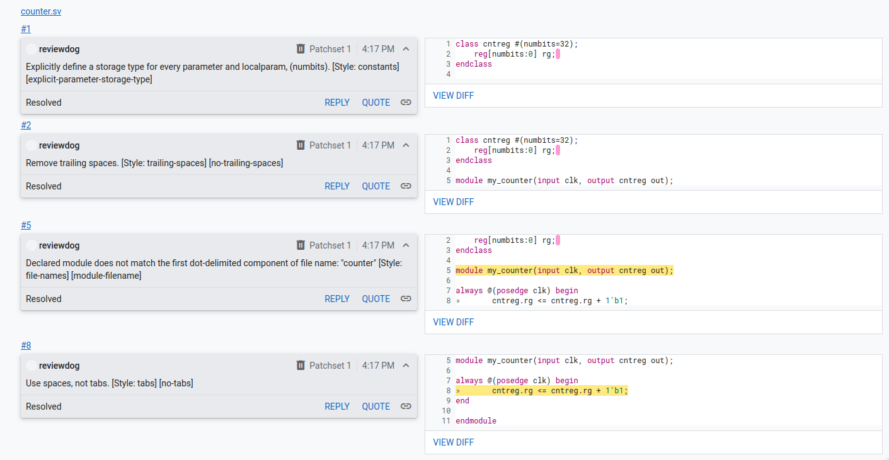

# Verible integration with Gerrit

Copyright (c) 2023 [Antmicro](https://www.antmicro.com>)

This project allows to create a docker container that runs Gerrit and automatically posts Verible warnings from example
repository as comments in Gerrit Change.

## Preparing necessary tools

### Installing requirements

1. Clone this repository.
2. Install [reviewdog](https://github.com/reviewdog/reviewdog#installation).
3. Install [Verible](https://github.com/chipsalliance/verible/releases).
4. Clone repository [verible-linter-action](https://github.com/chipsalliance/verible-linter-action).
4. Install `unidiff` using `pip`.
5. Apply [rdf_gen.diff](scripts/rdf_gen.diff) to verible-linter-action:
   ```
   cd <verible-linter-action-dir>
   git apply <verible-gerrit-example>/scripts/rdf_gen.diff
   ```

## Preparing a local Gerrit server

1. Create a container with Gerrit server.
   It can be done by the command:
   ```
   docker run -ti -p 8080:8080 -p 29418:29418 gerritcodereview/gerrit
   ```
   You can find more information [here](https://hub.docker.com/r/gerritcodereview/gerrit).

2. Create a repository.
   In the browser, go to page http://localhost:8080.
   Skip the intro and create repository by clicking:

   `BROWSE (on the menu on top of the page) -> Repositories -> CREATE NEW (in the top right corner)`

   Let's call it `test-repository`, with default `master` branch.

3. Create reviewdog user:
   1. Log into the container on which Gerrit runs:
      ```
      docker exec -u 0 -it <container name> /bin/bash
      ```
      You can check the container name by running `docker ps`
   2. Generate ssh keys by command `ssh-keygen`
   3. Add generated public key to the account - go to `SSH keys` section of account setting and paste there content of `/root/.ssh/id_rsa.pub`
   4. Finally run the command to create a user (in terminal opened with `docker exec`):
      ```
      ssh -p 29418 admin@localhost gerrit create-account --group "'Service Users'" --http-password rev_pass reviewdog
      ```

## Introducing new changes to the project

### Preparing the development environment

1. Add directory containing `verible-linter-action` to `$PATH`.
2. Make sure that directory containing `verible-verilog-lint` is added to `$PATH`
3. Set path to `reviewdog` executable in `$REVIEWDOG_BIN` variable.
4. Set environment variables required by Gerrit.
   It can be done by running:
   ```
   source <verible-gerrit-integration>/scripts/set_env.sh
   ```
   However, you may want to change some of them.

### Working with repository hosted by Gerrit

1. Clone a repository and add a hook.
   The hook adds a ChangeId field to commit messages, which is required by Gerrit. It can be done by the command:

   ```
   git clone "http://localhost:8080/test-repository" && (cd "test-repository" && mkdir -p .git/hooks && curl -Lo `git rev-parse --git-dir`/hooks/commit-msg http://localhost:8080/tools/hooks/commit-msg; chmod +x `git rev-parse --git-dir`/hooks/commit-msg)
   ```

   **NOTE**: On the project page there are also commands for cloning repository and adding hooks.
   However, they have URLs with hostname set to container ID.
   When using them, you should replace `<container-id>` with `localhost:8080`.

2. Create a commit and open a Change:

   ```
   cd test-repository/
   git checkout -b add-code
   echo -en "module mod; \nendmodule" > mod.v
   git add mod.v
   git commit -m "Add code"
   git push origin HEAD:refs/for/master
   ```
   To push, you need the account credentials.
   The default user in Gerrit image is `admin`.
   The password can be generated in account settings (`Account settings -> HTTP Credentials -> GENERATE NEW PASSWORD`).

3. After pushing the changes, you can go to project page, and click `VIEW CHANGES` (just under a project name) and see the change that was created. You can also click top `CHANGES -> Open` and select added `Add code` subject.

## Adding linting comments with `verible-linter-action`



The following steps assume that all steps from [adding changes to the project](#introducing-new-changes-to-the-project),
Assuming the current directory is `test-repository`:

1. Check `Change-Id`.
   It can be found in Gerrit change view, or in `git show`.
2. Run:
   ```
   <verible-gerrit-integration>/scripts/verible_script.sh <change-id>
   ```
3. It will run `verible-verilog-lint` on the `*.v` and `*.sv` files from the current directory.
   Warnings from the lines that are were not modified are skipped.
   You can now go to the Change on the project page and see the comment with Verible warning posted by `reviewdog` account.
   It should mark at least trailing spaces in the file created above.

## Testing the integration of Verible and Gerrit with Docker

All of the above steps can be reproduced in the script running in the `Dockerfile` given in the project.

To test the integration, create and run the container with:

```
docker build -t <container-name> .
docker run <container-name>
```

It will start the Gerrit server, and when it's ready it will create a project, run Verible linter to create warning about code style violations and will send those warning as comments into created Gerrit Change.
